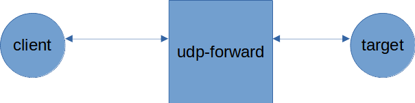
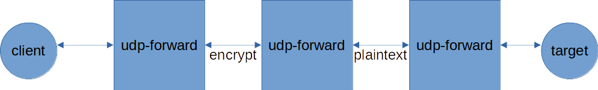

# Introduction
This is a tool for UDP forwarding from an address to a target address.

Here are some deployment examples:

**Simple Forward**

Listen a UDP port and forward to destination




**Forward Chain**




# Build the application
```
# For windows
go build -o udp-forward.exe main.go

# For Linux
go build -o udp-forward main.go
```

# Command line 
```
udp-forward -h

-destination-address string
    The destination address to send source data to
-destination-encrypt-key string
    The destination encrypt key for data encryption, leave empty means do not encrypt data send to destination
-source-address string
    The source address to listen and receive source data
-source-encrypt-key string
    The source encrypt key for data decription, leave empty means do not decription source data
```